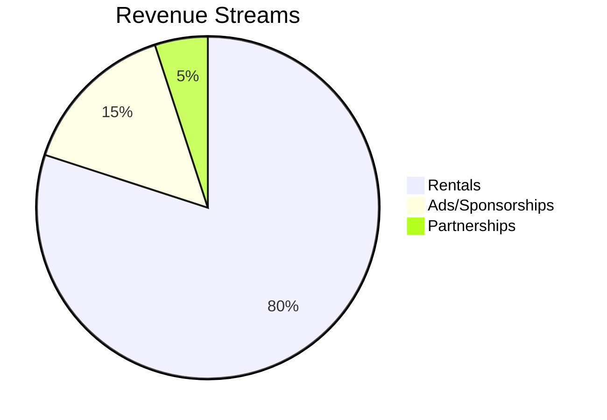

**Refined Prompt:**  
"Define and scope a comprehensive business plan for a **Bike Rental Service**, covering the following aspects:  

1. **Business Overview**:  
   - Mission, vision, and unique value proposition (e.g., eco-friendly, urban mobility, tourism-focused).  
   - Target audience (e.g., tourists, commuters, students) and geographic coverage (city-wide, campus-specific, etc.).  

2. **Operational Model**:  
   - Rental types (hourly, daily, subscription-based).  
   - Fleet composition (bike types: standard, electric, cargo bikes).  
   - Technology integration (app-based booking, GPS tracking, payment systems).  

3. **Infrastructure & Logistics**:  
   - Docking stations vs. dockless systems.  
   - Maintenance, security, and redistribution strategies.  

4. **Financial Viability**:  
   - Pricing strategy (dynamic pricing, discounts).  
   - Revenue streams (rentals, ads, partnerships).  
   - Cost structure (acquisition, maintenance, staffing).  

5. **Regulatory & Sustainability Considerations**:  
   - Compliance with local transport laws.  
   - Environmental impact and green initiatives (e.g., carbon offset programs).  

6. **Risk Assessment**:  
   - Potential challenges (theft, vandalism, seasonal demand) and mitigation plans.  

Provide a structured outline with actionable recommendations and examples from successful bike-sharing programs (e.g., Citi Bike, Lime)."  

*Format the output as a detailed report with clear sections and bullet points.*

---

---

---

# Comprehensive Business Plan for a Bike Rental Service  

## **1. Business Overview**  

### **Mission & Vision**  
- **Mission:** Provide affordable, eco-friendly urban mobility solutions to reduce traffic congestion and carbon emissions.  
- **Vision:** Become the leading bike-sharing service in [Target City/Region], promoting sustainable transportation.  

### **Unique Value Proposition (UVP)**  
- **Eco-Friendly Focus:** Zero-emission transport with optional carbon offset subscriptions.  
- **Tourism & Commuter Solutions:**  
  - Tourists: Convenient access to sightseeing routes.  
  - Commuters: Cost-effective alternative to public transit/cars.  
- **Tech-Driven Convenience:** Seamless app-based rentals, real-time bike tracking.  

### **Target Audience & Geographic Coverage**  
| Segment | Needs | Coverage Area |  
|---------|-------|--------------|  
| Tourists | Short-term rentals, guided routes | City center, tourist hotspots |  
| Commuters | Reliability, affordability | Transit hubs, business districts |  
| Students | Budget-friendly options | Universities, residential areas |  

---

## **2. Operational Model**  

### **Rental Types**  
- **Pay-Per-Use:** Hourly/daily rates (e.g., $3/hour, $15/day).  
- **Subscriptions:** Monthly passes ($30–$50) with unlimited short rides.  
- **Corporate Partnerships:** Bulk discounts for employees.  

### **Fleet Composition**  
- **Standard Bikes:** 70% of fleet (low-cost, high durability).  
- **E-Bikes:** 20% (premium pricing, hilly areas).  
- **Cargo Bikes:** 10% (niche demand for deliveries).  

### **Technology Integration**  
- **Mobile App Features:**  
  - Real-time bike availability and GPS navigation.  
  - QR code unlocks, in-app payments (credit/debit, digital wallets).  
- **Backend Systems:**  
  - IoT sensors for maintenance alerts.  
  - AI-driven demand forecasting for redistribution.  

---

## **3. Infrastructure & Logistics**  

### **Docking vs. Dockless**  
| Model | Pros | Cons | Example |  
|-------|------|------|---------|  
| **Docked** | Lower theft/vandalism | High infrastructure cost | Citi Bike (NYC) |  
| **Dockless** | Flexibility, lower setup cost | Parking clutter risks | Lime (Berlin) |  
| **Hybrid** | Balanced approach | Complex management | Santander Cycles (London) |  

### **Maintenance & Redistribution**  
- **Maintenance:** Weekly checks; partnerships with local repair shops.  
- **Redistribution:** Vans/e-cargo bikes to move bikes from low- to high-demand zones.  
- **Security:** GPS tracking, $50 deposit for dockless systems.  

---

## **4. Financial Viability**  

### **Pricing Strategy**  
- **Dynamic Pricing:** Surge pricing during peak hours (e.g., +20% during rush hour).  
- **Discounts:** Off-peak promotions, student discounts.  

### **Revenue Streams**  
1. **Rental Fees:** Primary income (80% of revenue).  
2. **Ads & Sponsorships:** Bike branding, app placements (e.g., Uber Bike).  
3. **Partnerships:** Revenue share with hotels/cafés for docking stations.  

### **Cost Structure**  
| Cost Type | Estimated Monthly |  
|-----------|------------------|  
| Bike Acquisition | $50,000 (200 bikes @ $250/unit) |  
| Maintenance | $5,000 |  
| Staffing | $10,000 (operators, customer support) |  
| Marketing | $3,000 |  

---

## **5. Regulatory & Sustainability Considerations**  

### **Compliance**  
- **Permits:** Municipal licenses for parking/docking.  
- **Insurance:** Liability coverage for riders.  

### **Green Initiatives**  
- **Carbon Offsets:** Optional $1/month add-on to fund tree planting.  
- **Recycling:** Upcycle retired bikes into art or donate to NGOs.  

---

## **6. Risk Assessment & Mitigation**  

| Risk | Likelihood | Impact | Mitigation |  
|------|------------|--------|------------|  
| Theft/Vandalism | Medium | High | GPS tracking, security deposits |  
| Seasonal Demand | High | Medium | Winter promotions (e.g., "Winter Warrior" discounts) |  
| Regulatory Changes | Low | High | Lobbying for bike-friendly policies |  

---

## **Actionable Recommendations**  
1. **Pilot Phase:** Launch with 100 bikes in high-demand zones (e.g., downtown).  
2. **Tech Priority:** Invest in AI redistribution to minimize "bike deserts."  
3. **Community Engagement:** Partner with local NGOs for safety campaigns.  
4. **Scale-Up:** Expand to suburbs after 12 months of profitability.  

### **Lessons from Successful Programs**  
- **Citi Bike (NYC):** Docked model ensures accountability.  
- **Lime (Berlin):** Dockless + geofencing reduces clutter.  

--- 

**Visual Summary:**  

*Note: Adjust fleet size/pricing based on local population density and competition.*