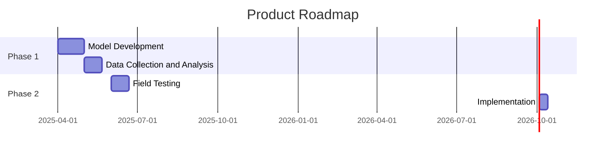

# AKM Modelling for O&G Exploration Project Plan

## 1. Project Overview
The AKM Modelling for O&G Exploration Project is an initiative to leverage advanced analytical modelling techniques for efficient Oil and Gas exploration. The project will involve the application of AKM (Analytical Knowledge Modelling) to predict potential oil and gas reserves.

## 2. Scope Domain
The project scope includes the development of the AKM model, data collection and analysis, field testing, and final implementation of the model in exploration activities.

## 3. Key Stakeholders
- Project Team
- Project Sponsor
- O&G Exploration Team
- Data Analysts
- Field Engineers

## 4. Objectives
- Develop an effective AKM model for O&G exploration
- Improve the efficiency and success rate of exploration activities
- Reduce the environmental impact of exploration

## 5. Timeline

## 6. Resources
The project will require:

- A team of data analysts and scientists
- Field engineers for testing and implementation
- O&G exploration experts

## 7. Risks and Mitigation Strategies
- Risk: Inaccurate data
  - Mitigation Strategy: Use reliable sources and validate data
- Risk: Ineffective model
  - Mitigation Strategy: Regular testing and refinement of the model

## 8. Success Criteria
- Accurate prediction of oil and gas reserves
- Improved success rate of exploration activities
- Reduced environmental impact

## 9. Budget
The total estimated budget for the project is $500,000. This includes the cost of data collection, model development, and field testing.

## 10. Communication Plan
- Monthly updates to stakeholders
- Weekly meetings within the project team to track progress

## 11. Evaluation and Reporting
Project success will be evaluated based on the success criteria and will be reported to the stakeholders at the end of each phase.

## 12. Conclusion
The AKM Modelling for O&G Exploration Project aims to revolutionize the way we perform oil and gas exploration by leveraging advanced analytical knowledge modelling.

## 13. Appendix

## 14. References

## 15. Glossary of Terms

## 16. Acknowledgments

## 17. Additional Notes
